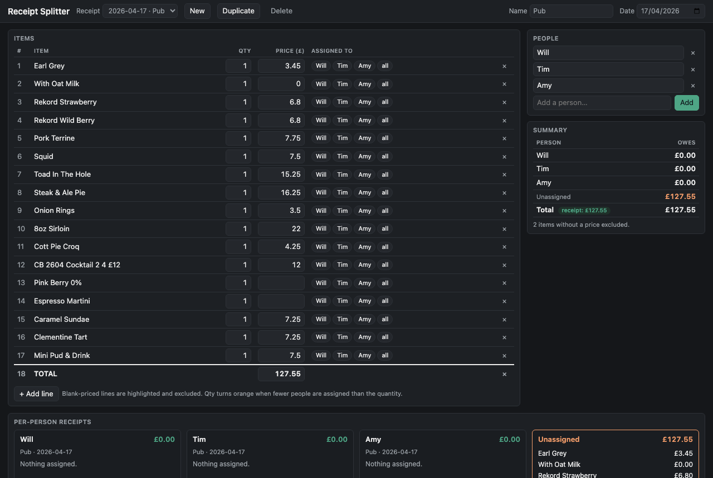

# Receipt Splitter

A single-file HTML app for splitting receipts between people. No build step — open `index.html` in a browser. An optional Flask server adds autosaving to disk.



## Usage

1. Open `index.html` in any modern browser.
2. Edit the receipt name and date in the header.
3. Add/edit items in the table (or paste a TSV at the bottom).
4. Manage the people list on the right (defaults to Will, Tim, Amy).
5. Click chips on each line to assign that item — the price is split equally among the assignees.
6. The summary shows what each person owes, and per-person itemised receipts appear at the bottom.

## TSV format

Tab-separated, one item per line. The first column is an optional line number; a header row (`Item / Quantity / Price`) is skipped automatically.

```
1	Item	Quantity	Price
2	Earl Grey	1	3.45
3	Steak & Ale Pie	1	16.25
4	TOTAL		127.55
```

A row whose label starts with `TOTAL` is treated as the receipt total and used to flag mismatches against the computed sum. Items with a blank price are highlighted and excluded from the split.

See `examples/2026-04-17_pub.tsv` for a full example.

## Saving to a server (optional)

The app works entirely client-side, but `server.py` adds server-side autosaving. Dependencies are declared inline (PEP 723), so [uv](https://docs.astral.sh/uv/) runs it with no setup:

```
uv run server.py    # http://127.0.0.1:5001  (5000 is taken by macOS AirPlay)
```

Open the app at that URL and every change is autosaved (debounced) to `data/<date>_<name>.tsv`. Opened directly as a `file://`, the app simply skips autosaving.

## Features

- Multiple receipts persisted to `localStorage` (New / Duplicate / Delete).
- Per-person receipts with `÷N` split markers.
- Mismatch warnings between the assigned total and the receipt's declared total.
- Import TSV; export to clipboard or download as `<date>_<name>.tsv`.
- Follows the OS dark-mode preference.

## License

MIT — see `LICENSE`.
